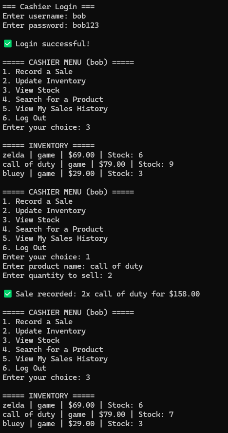

# Video Game Store Cashier System

## Purpose
The **Video Game Store Cashier System** is a command-line application designed to help manage sales, inventory, and staff in a video game store. It allows cashiers to record sales and update inventory while providing managers with advanced features like cashier management and sales reporting.



## Requirements
To run this program, ensure you have the following installed:
- Python 3.7+
- A terminal or command prompt

## Installation
1. Clone or download this repository.
2. Navigate to the project directory in your terminal.

## How to Run the Program
Run the following command in your terminal:
```bash
python main.py
```
The program will start the interactive menu, allowing users to log in and perform store operations.

## Object-Oriented Principles Used
This program follows key **Object-Oriented Programming (OOP)** principles:

### ✅ Encapsulation
- Each class **stores and manages** its own data (e.g., `User`, `Product`, `Inventory`).
- Helper functions are used to **validate input** and prevent direct access to attributes.

### ✅ Inheritance
- `Cashier` and `Manager` classes **inherit** from the `User` base class.
- This reduces redundancy and ensures role-specific behaviors are properly managed.

### ✅ Polymorphism
- `User` class provides a common interface for `Cashier` and `Manager`, allowing different menu actions based on role.
- `SalesTracker` records sales for both **cashiers** and **managers** without changing its logic.

### ✅ Abstraction
- Users interact through **a simple menu system**, hiding the complex implementation behind intuitive commands.
- Functions like `record_sale()` and `update_inventory()` simplify backend logic while keeping the UI user-friendly.

## Project Structure
```
├── cli/
│   ├── menu.py             # Handles menu interactions
│
├── models/
│   ├── user.py             # User classes (Cashier, Manager)
│   ├── user_database.py    # Handles authentication and user management
│   ├── product.py          # Product class
│   ├── inventory.py        # Inventory management
│   ├── sale.py             # Sale transaction class
│   ├── sales_tracker.py    # Records and tracks sales history
│
├── utils/
│   ├── helpers.py          # Utility functions for validation
│
├── main.py                 # Program entry point
└── README.md               # Documentation
```

## Step-by-Step Development Process

### **Step 1: Create a Simple CLI Menu**
- Create a `main.py` file with a text-based menu.
- Use a loop to display options and accept user input.
- Allow users to log in as a cashier, manager, or exit (no real authentication yet).
- Provide placeholder functions for menu choices.

### **Step 2: Define Classes for Users**
- Create a `User` base class with `username` and `role` (cashier or manager).
- Create two subclasses: `Cashier` and `Manager`, which inherit from `User`.
- Update the menu so that when a user "logs in," an object of `Cashier` or `Manager` is created.
- Implement a simple logout mechanism (reset user to `None`).

### **Step 3: Implement Inventory System**
- Create a `Product` class with attributes: `name`, `category`, `price`, and `stock`.
- Create an `Inventory` class that:
  - Holds a list of products.
  - Allows users to add, delete, and update products.
- **Managers** can add and delete products, **cashiers** can only update stock.

### **Step 4: Implement Sales Tracking**
- Create a `Sale` class with: `product_name`, `quantity_sold`, `total_price`, and `cashier_name`.
- Modify `Inventory` to deduct stock when a sale is recorded.
- Store each sale in a `sales_history` list inside a `SalesTracker` class.
- Allow **cashiers** to view their sales history.
- **Managers** can view all sales history.

### **Step 5: Implement User Management (For Managers)**
- Maintain a `UserDatabase` class storing all users.
- **Managers** can:
  - Create a new cashier (add to the list).
  - Delete a cashier (remove from the list).
  - View all registered cashiers.
- Modify login logic to check if the user exists in `UserDatabase`.

### **Step 6: Implement Search and Reports**
- Implement a **search feature** that lets users find a product by name.
- Implement a **total revenue tracker** (sums up all sales).
- Make it so that **Managers** can see total revenue.
- Store products and sales in dictionaries or lists for easy access.

## Challenge
Try cloning this repo and adding the following enhancements: 
- Implement discounts & promotions (e.g., Buy 1 Get 1 Free)
- Add daily sales reports and revenue tracking by date
- Introduce customer accounts with loyalty points
- Write unit tests and functional tests
- Add auditing for when inventory is updated as well, like sales history
- Save and load data to a CSV or JSON file to have persistence
- Hash passwords to improve security
- Improve error handling and input validation